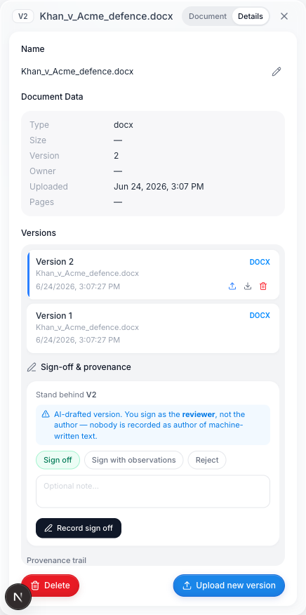
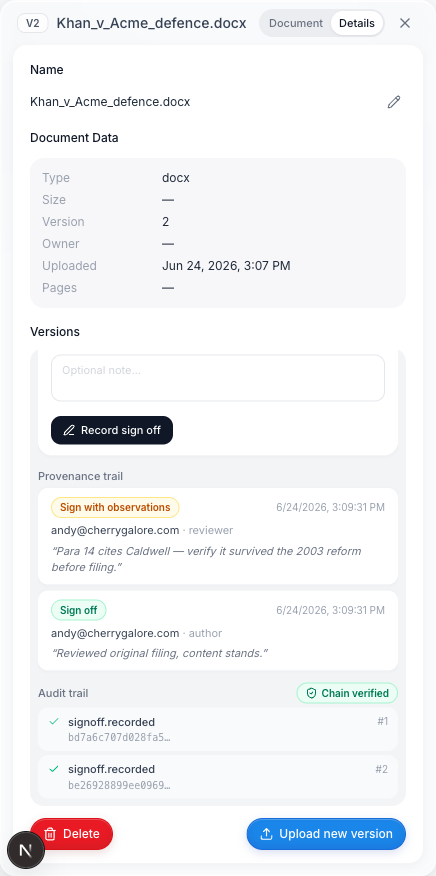
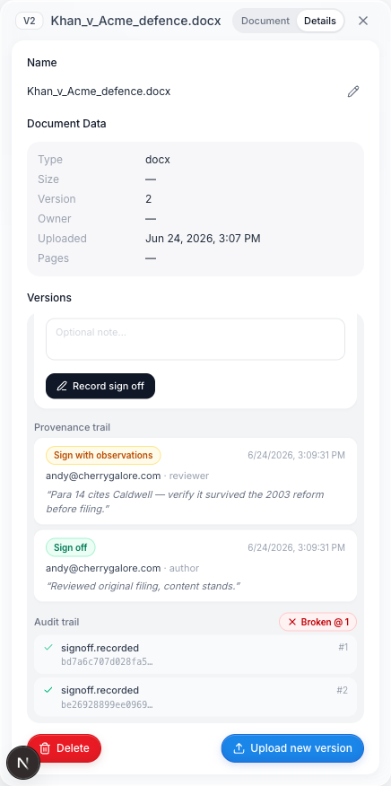

# Mike × Legalise — a portability experiment

> **This is an experimental fork of [Mike](https://github.com/willchen96/mike) — not a product, and not a proposed change to Mike.** It exists to answer one question: can a governance layer built for one legal‑AI workspace drop cleanly into a *different* one it was never designed for? Here it is, running natively inside Mike. Source is public under the same licence as upstream (AGPL‑3.0). Nothing here is headed for Mike's `main` beyond a separate, unrelated content‑hashes PR ([willchen96/mike#181](https://github.com/willchen96/mike/pull/181)).

## What this is

[Legalise](https://github.com/b1rdmania/legalise) is an open‑source **governance layer for legal AI** — human sign‑off plus a tamper‑evident audit trail for work an AI helped produce. The thesis is that these controls shouldn't be welded to one product; they should bolt onto whatever workspace you already use.

This fork is the proof. We grafted the Legalise controls onto **Mike**, an open‑source legal document assistant we don't own, and they run natively — against Mike's own Postgres and auth, with no Legalise stack anywhere in the picture.

The honest framing: **Mike already has a natural home for this.** That's the whole point. Not "we integrated our thing into Mike" — rather, "these controls travel, and here's one workspace they travelled to."

## What we added

A self‑contained layer (~900 lines across 7 files) on top of upstream Mike:

**Backend**
- `document_signoffs` and `audit_events` tables (`backend/schema.sql`)
- `backend/src/lib/auditChain.ts` — a per‑document SHA‑256 hash chain
- Four routes in `backend/src/routes/documents.ts`: record a sign‑off, list sign‑offs, read the audit trail, and **verify** the chain

**Frontend**
- `DocumentSignoffPanel.tsx` + a `useDocumentSignoffs` hook + API helpers, mounted under the Versions list in Mike's document side‑panel

**The keystone rule** (enforced server‑side): for any `generated` or `assistant_edit` document version, `signer_is_author` is **forced to false**. Nobody can sign as the author of machine‑written text. The entire point of the layer is that a *human* takes responsibility for AI output, and the record is not allowed to pretend otherwise.

## See it work

These are real screengrabs from the running Mike UI with the layer mounted.

**1 — Sign‑off panel, inside Mike's document side‑panel**

**2 — The audit chain verifies**

**3 — Tamper a past row directly in the database → verification fails, and points at the break**

Validated end‑to‑end against a local Supabase stack (real Postgres, auth, JWT): a human‑uploaded version signs with author = true; an AI‑drafted version signs with author **forced** false even for the same user; the provenance trail is intact; the chain verifies; and a direct‑database edit of a past row makes verification return `ok: false` with the broken sequence index.

## Run it yourself

The layer needs only Mike's own dependencies — no Legalise services, and no model keys for the sign‑off path.

1. Start a local Supabase stack: `npx supabase start`
2. Apply `backend/schema.sql`, then `grant all on all tables in schema public to service_role;` (cloud Supabase grants this automatically; local does not)
3. Point the backend `.env` `SUPABASE_URL` at the local API; dummy R2 / model keys are fine
4. Run Mike's backend and frontend as usual (front end on `:3002` if something else owns `:3000`; set the backend `FRONTEND_URL` to match for CORS)
5. Upload a document, draft a version with the assistant, and open the sign‑off panel under Versions

## What this is *not*

- **Not a product.** It's a portability demo for [Legalise](https://github.com/b1rdmania/legalise).
- **Not a change to Mike.** These commits live only on this fork; nothing is proposed to Mike's `main` beyond the unrelated [#181](https://github.com/willchen96/mike/pull/181).
- **Experimental.** It exercises one path (document sign‑off + audit). Expect rough edges.

## Credits & licence

[**Mike**](https://github.com/willchen96/mike) is an open‑source legal document assistant by [Will Chen](https://github.com/willchen96) — Next.js + Express + Supabase + Cloudflare R2, [mikeoss.com](https://mikeoss.com). All credit for the workspace this builds on is his.

This fork is distributed under Mike's licence, **AGPL‑3.0**; the added governance layer is part of the [Legalise](https://github.com/b1rdmania/legalise) project and is published here under the same terms.
